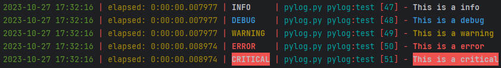

You can use this function to generate a logger to help you manage the logging outputs of your python project.


## Installation

Before use this function, you need to install `loguru` first.

```bash
pip install loguru
```


## Simple usage

We have defined a default output format for you. Anyway, you can modify the format (content, color) by yourself.

```python
from pylog import init_logger


log = init_logger('{LOG_FILE_PATH}')
log.info(f'This is a info')
log.debug(f'This is a debug')
log.warning(f'This is a warning')
log.error(f'This is a error')
log.critical(f'This is a critical')
```




## More usage & Reference

[Loguru documentation](https://loguru.readthedocs.io/en/stable/index.html)

