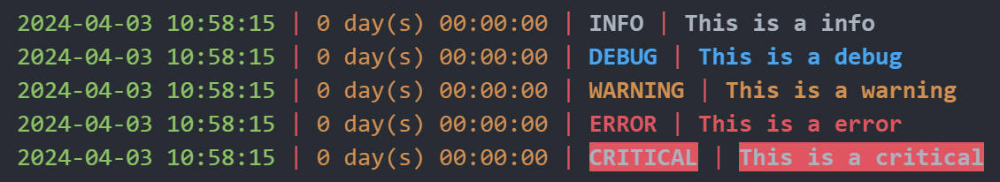

You can use this module to generate a logger to help you manage the logging outputs of your python project.


## Installation

Before use this module, you need to install requirements by running the following command.

```bash
pip install -r requirements.txt
```


## Usage

### Simple usage

Import the module before using it.

```python
from pylog import Logger
```

An example of a simple usage is as follows.

```python
logger = Logger()
logger.init_logger()
logger.info('This is a info')
logger.debug('This is a debug')
logger.warning('This is a warning')
logger.error('This is a error')
logger.critical('This is a critical')
```



### Save log file

You can specify a path to save the log file when you init the logger. The suffix of log file should be `.log`.

```python
logger = Logger()
logger.init_logger('root_dir/logfile.log')
```

### Customize logging format

We have defined a default output format for you, i.e. `{now_time} | {elapsed} | {level} | {message}`.

The default output format setting is as follows.

```python
_default_format = dict(log_info=[dict(info="{extra[now_time]}", color="green"),
                                 dict(info="{extra[elapsed]}", color="yellow"),
                                 dict(info="{level}", color="level"),
                                 dict(info="{message}", color="level")],
                       separator=dict(symbol=" | ", color="red"))
```

Anyway, you can modify the format (content, color) by yourself. Please refer to [Loguru documentation](https://loguru.readthedocs.io/en/stable/index.html) for more details.

### Time format

Note that we defined the `now_time` and `elapsed` by the `extra` args in `logger.configure()` method.

The default format of `now_time` is `%Y-%m-%d %H:%M:%S`, i.e. `{year}-{month}-{day} {hour}:{minute}:{second}`.

You can specify the time format of `now_time` when you init the logger.

```python
logger = Logger()
logger.init_logger('root_dir/logfile.log', timeformat='%Y.%m.%d %H:%M:%S')
```

Besides, the default format of `elapsed` is `%d day(s) %H:%M:%S`, i.e. `{day} day(s) {hour}:{minute}:{second}`. Noted that the time scale of `elapsed` only support `%d`-day, `%H`-hour, `%M`-minute, `%S`-second.

You can specify the time format of `elapsed` when you init the logger.

```python
logger = Logger()
logger.init_logger('root_dir/logfile.log', elapsedformat='%H:%M:%S')
```

### Timezone

The default timezone is `Asia/Shanghai`. You can specify a timezone of `UTC` when you init the logger.

```python
logger = Logger()
logger.init_logger('root_dir/logfile.log', timezone='UTC')
```

There are over 500 timezones supported by `pytz`, all the name of timezones are listed in `tutorial.ipynb`, FYI.


## More usage & Reference

For more advanced usage of `Logger`, please refer to the source code and the [Loguru documentation](https://loguru.readthedocs.io/en/stable/index.html).

